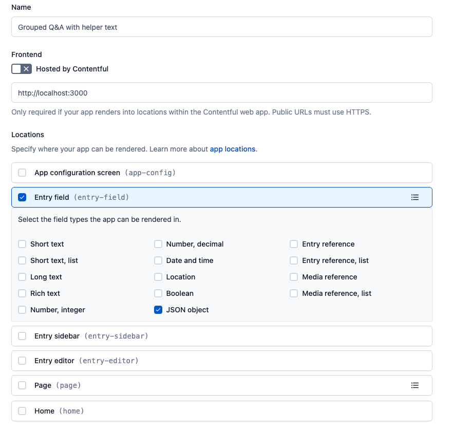

# Grouped Q&A App

The Grouped Q&A App creates a repeatable list of key-value pairs in the Contentful web app.


The Grouped Q&A app utilizes the Contentful [JSON Field](https://www.contentful.com/developers/docs/concepts/data-model/#:~:text=JSON%20Object) to store a simple `Item` data stucture:

```ts
{
    id: string; // automatically generated by the app
    question: string;
    group: string;
    anwser: string;
}
```

*Note that the `id` property is automatically generated and useful for developers
to differentiate between different list items even if the labels are the same or similar*

An example item in the Contentful response:

```json
{
    "fields": {
        "questions": [
            {
                "id": "fisgh9s8e-sdfhap832",
                "question": "<h1>Demo Question</h1>",
                "group": "Demo Title",
                "answer": "<h1>Demo Answer</h1>"
            }
        ]
    }
}
```

## For Developers: Running This App Locally

> This project was bootstrapped with [Create Contentful App](https://github.com/contentful/create-contentful-app).

Before running the app locally, you will need to do 2 things:
* Ensure your Contentful user is admin or developer for the organization.
* Create an [`AppDefinition`](https://www.contentful.com/developers/docs/extensibility/app-framework/app-definition/)
in your organization with the following properties:
    * The App URL: http://localhost:3000
    * An entry field location with a type of JSON Object

If you are using the UI to create the `AppDefinition`, it should look like this:




Once your app definition is created, running `yarn start` will start a local server on
port 3000 (http://localhost:3000).

You must create or modify a content type which has a JSON field in order to see the app
inside of the Contentful web app.

## Learn More

[Read more](https://www.contentful.com/developers/docs/extensibility/app-framework/create-contentful-app/) on how to use the CLI.

Create Contentful App uses [Create React App](https://create-react-app.dev/). You can learn more in the [Create React App documentation](https://facebook.github.io/create-react-app/docs/getting-started) and how to further customize your app.
